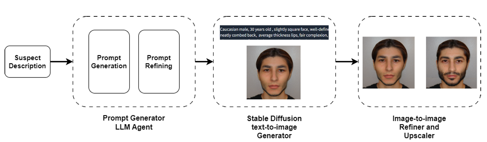
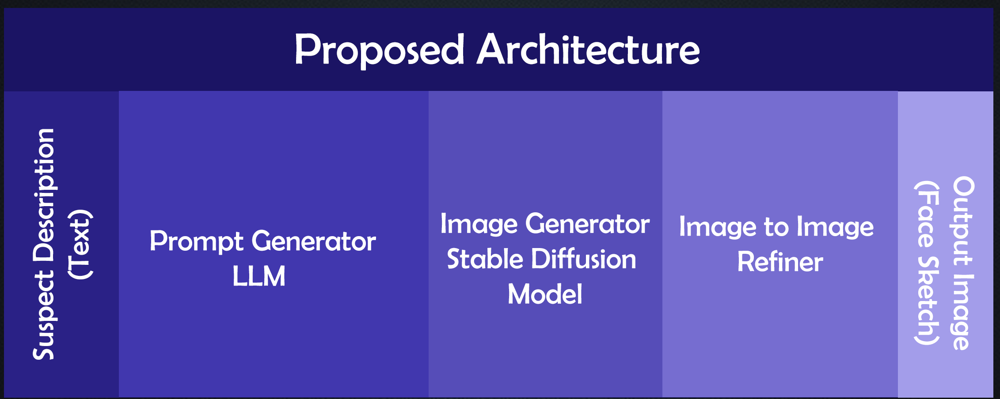
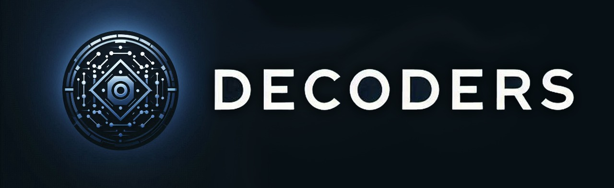

# Stable Diffusion Based Criminal Face Generation Platform for Forensic Identification

## Project Overview

### Project Idea

Our project addresses the limitations of traditional forensic face sketch methods, commonly known as composite sketching. These methods often suffer from subjectivity, inconsistency, and inefficiency due to their reliance on human interpretation and manual creation processes.

Recognizing the critical need for more accurate, objective, and timely forensic tools in law enforcement, we were inspired to develop a solution leveraging the latest advancements in stable diffusion technology. Traditional sketching techniques can lead to inaccurate depictions of suspects, hindering criminal investigations. By addressing these challenges, our team aims to provide law enforcement agencies with a reliable tool for facial synthesis in forensic investigations.

### Problem Significance

Traditional forensic face sketch methods heavily depend on the interpretation and artistic skills of forensic artists, resulting in subjective and varying levels of accuracy. Manual sketching is also time-consuming, which can lead to inaccuracies due to the rapid degradation of witness memory. Additionally, the unfamiliarity of the general public with composite sketches can discourage potential witnesses from coming forward, hindering the effectiveness of this method in criminal investigations.

The accuracy and speed of suspect identification are crucial in criminal investigations. Inaccurate sketches or delays in the sketching process can impede law enforcement efforts, potentially leading to the evasion of justice or wrongful arrests. The reliance on subjective interpretation can introduce biases, affecting the fairness and integrity of legal proceedings. Addressing these challenges can lead to more accurate suspect identifications, faster apprehensions, and improved public trust in law enforcement agencies.

### Problems with Existing Solutions

Existing solutions, such as AI face recognition technologies, have significant limitations. AI-based face recognition systems are reactive and rely heavily on pre-existing databases. Suspects not cataloged or those who have significantly altered their appearance pose challenges to these systems, potentially rendering them ineffective in crucial investigative scenarios.

Biometric identification systems analyze unique physical characteristics such as fingerprints, iris patterns, or DNA profiles. However, these systems also rely on accurate and comprehensive databases. Incomplete or outdated databases can lead to false negatives or misidentifications. Data privacy and security concerns are significant, as biometric data is sensitive and can be susceptible to breaches or misuse. Reliability and consistency issues, such as variations in fingerprint quality or environmental factors affecting iris scans, can impact the accuracy of identification results.

## Solution Overview

Our proposed solution combines several AI models to generate suspect face sketches based on given textual input. Specifically, our system includes:

- **Prompt Generator LLM:** Extracts important facial features from suspect descriptions and refines them for image generation.
- **Stable Diffusion Model:** Transforms textual descriptions into images, enhancing the quality and diversity of generated sketches while minimizing artifacts.
- **Image-to-Image Refiner:** Allows users to make minor adjustments to generated sketches while preserving facial composition, ensuring the final output meets user requirements.

By using stable diffusion models instead of other available options, such as GANs (Generative Adversarial Networks), we enhance the quality and diversity of generated sketches while minimizing artifacts. Training a diffusion model is easier and has less chance of model collapse.

## Impact

The positive impact of our solution within the community is significant, enhancing the efficiency and effectiveness of criminal investigations. By providing law enforcement agencies with a faster, more accurate, and objective method for facial synthesis, our solution can lead to quicker suspect identifications, apprehensions, and the administration of justice. The user-friendly interface and real-time generation capabilities make our solution applicable to various real-life scenarios, from field investigations to office environments.

## Proposed Architecture

- Prompt Generator LLM
- Image Generator Stable Diffusion Model
- Image-to-Image Refiner

## Project Documentation

This repository contains the source code and supporting documentation for this project. For real-time updates and a more comprehensive overview of the project, please refer to the following Overleaf project:

[https://www.overleaf.com/read/brpmhskrpzwq#0ddd79](https://www.overleaf.com/read/brpmhskrpzwq#0ddd79) 

**Collaborators:**

* [Kumal Hewagamage](https://github.com/KumalHewagamage)
* [Yasiru Basnayake](https://github.com/YasiruDEX)
* [Eshan Surendra](https://github.com/eshansurendra)

Join us in our mission to transform forensic identification and support law enforcement with cutting-edge AI technology. Explore our repositories to learn more about our project, contribute, and collaborate with Team Decoders.

